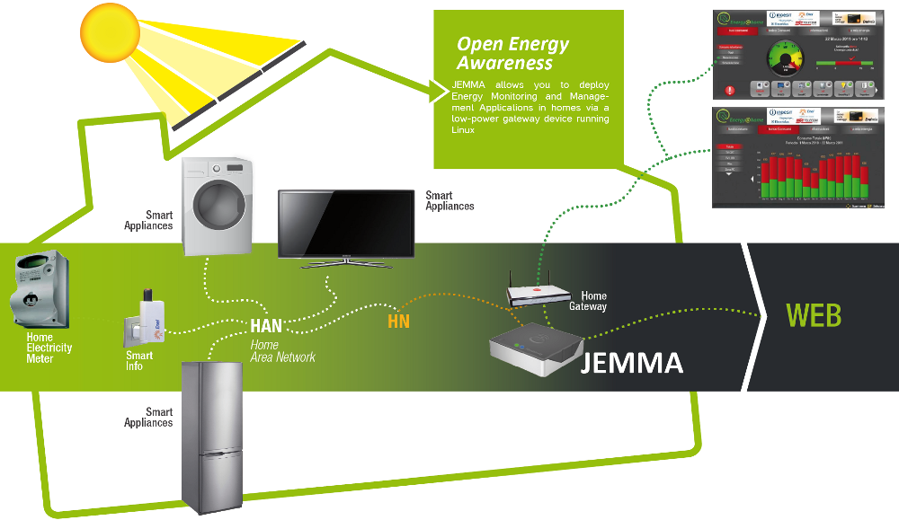

Welcome to JEMMA
<!-- Remember: the first line always goes with the title-->
<!-- Please use h3 headers (###) inside these files -->

Welcome to the home page of **JEMMA** - **J**ava **E**nergy **M**anage**M**ent **A**pplication framework.

<table>
<tr>
	<td>
	

               

                        <a href="https://github.com/ismb/jemma/releases/download/v0.0.1/jemma-0.0.1.zip"><b>Download JEMMA v0.0.1</b> 
			</a> 
                

        

	</td>
	<td>
		

			

                        	<a href="https://github.com/ismb/jemma/wiki/Documentation" target="_blank"><b>Documentation</b> 
				</a> 
        	        

		

       	</td>
	<td>
			

			

                        	<a href="https://github.com/ismb/jemma" target="_blank"><b>Source Code</b> 
				</a> 
        	        

		

	</td>
</tr>
</table>

JEMMA is a open-source (LGPL) framework which implements the <a href="http://www.energy-home.it/Documents/Technical%20Specifications/E@H_specification_ver0.95.pdf" target="_parent">Energy@home specifications</a> for energy monitoring and management application. JEMMA currently supports the <a href="http://www.zigbee.org/Standards/ZigBeeHomeAutomation/Overview.aspx" target="_parent">ZigBee Home Automation 1.2</a> and the <a href="http://www.zigbee.org/Standards/ZigbeeTelecomServices/Features.aspx" target="_parent">ZigBee Gateway Device</a> standards resulting from of a collaboration between the <a href="http://www.energy-home.it/" target="_parent">Energy@home Association</a> and the <a href="http://www.zigbee.org/" target="_parent">ZigBee Alliance</a>.

<!--(e.g. smart Plugs, Smart appliances, energy storages, energy sources, etc.)-->

