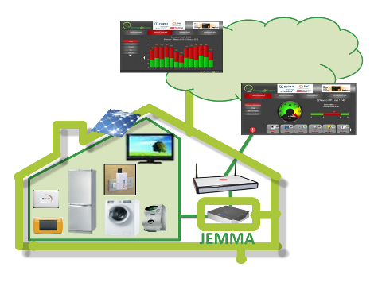

Welcome to JEMMA
<!-- Remember: the first line always goes with the title-->
<!-- Please use h3 headers (###) inside these files -->

Welcome to the home page of **JEMMA** - **J**ava **E**nergy **M**anage**M**ent **A**pplication framework.

<!---->

JEMMA is a open-source (LGPL) framework which implements the <a href="http://www.energy-home.it/Documents/Technical%20Specifications/E@H_specification_ver0.95.pdf" target="_parent">Energy@home specifications</a> for energy monitoring and management application. JEMMA currently supports the <a href="http://www.zigbee.org/Standards/ZigBeeHomeAutomation/Overview.aspx" target="_parent">ZigBee Home Automation 1.2</a> and the <a href="http://www.zigbee.org/Standards/ZigbeeTelecomServices/Features.aspx" target="_parent">ZigBee Gateway Device</a> standards resulting from of a collaboration between the <a href="http://www.energy-home.it/" target="_parent">Energy@home Association</a> and the <a href="http://www.zigbee.org/" target="_parent">ZigBee Alliance</a>.

<!--(e.g. smart Plugs, Smart appliances, energy storages, energy sources, etc.)-->

